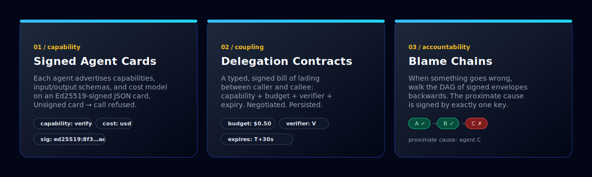
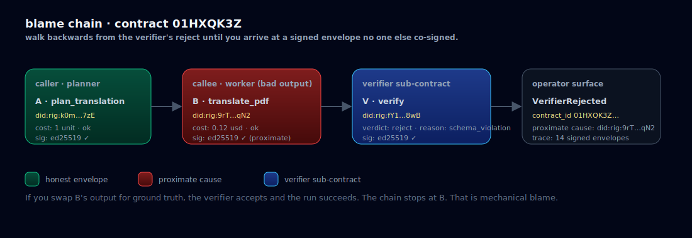
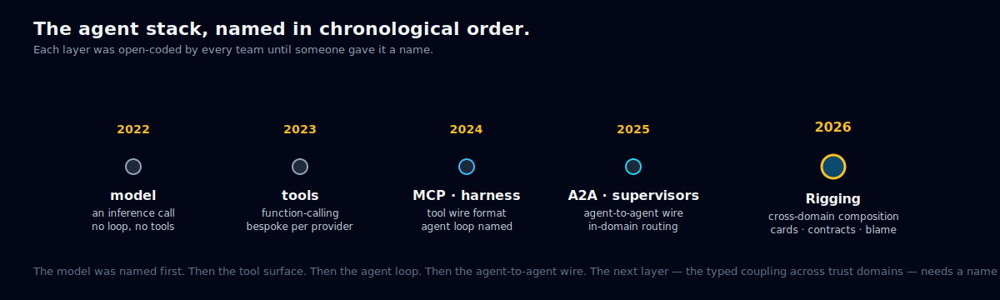
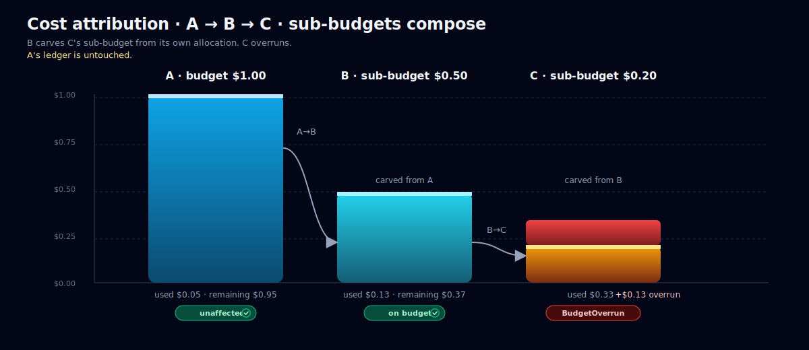
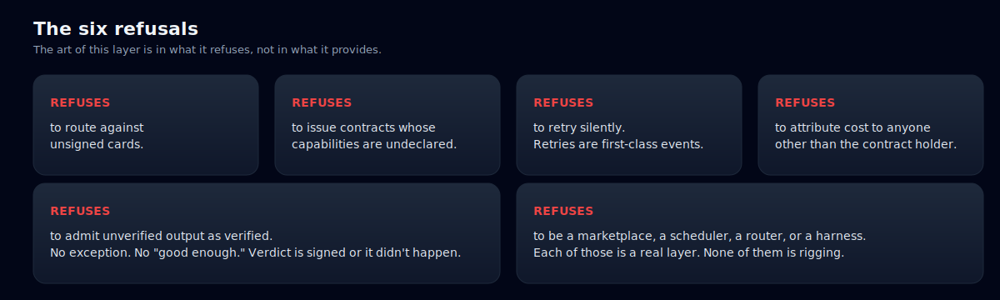
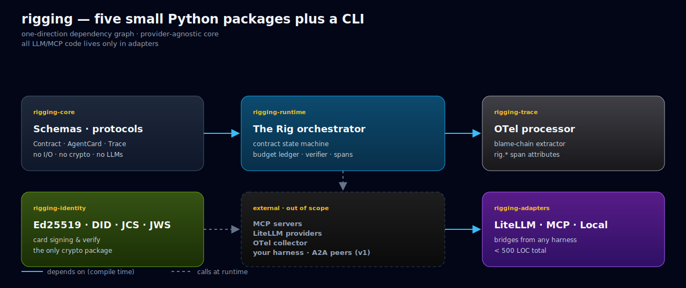
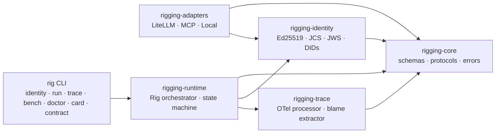
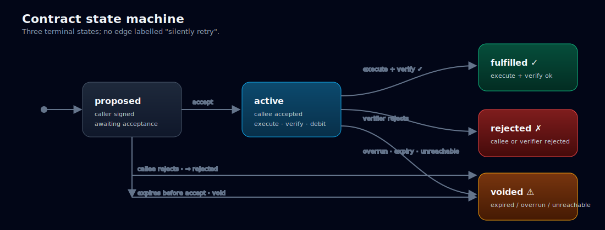

<div align="center">


# rigging

**_A harness is for one agent. Rigging is for the fleet._**

The typed, trust-bearing, schema-mediated coupling layer that composes
heterogeneous harnessed agents into a single coherent system.

<p>
  <a href="https://github.com/bettyguo/rigging/actions/workflows/ci.yml"></a>
  <a href="https://github.com/bettyguo/rigging/actions/workflows/pages.yml"></a>
  
  
  
  
  
</p>

<p>
  <a href="https://github.com/bettyguo/rigging/stargazers"></a>
  <a href="https://github.com/bettyguo/rigging/network/members"></a>
  <a href="https://github.com/bettyguo/rigging/issues"></a>
  <a href="https://github.com/bettyguo/rigging/commits/main"></a>
  <a href="https://github.com/bettyguo/rigging"></a>
  <a href="./CONCEPT.md"></a>
</p>

<p>
  <a href="https://bettyguo.github.io/rigging/"><kbd>🌊 Live site &amp; interactive demo</kbd></a>
  &nbsp;<a href="https://bettyguo.github.io/rigging/cheatsheet.html"><kbd>🧾 Cheatsheet</kbd></a>
  &nbsp;<a href="./CONCEPT.md"><kbd>📖 Long-form essay</kbd></a>
  &nbsp;<a href="./docs/spec/rig-contract-v0.md"><kbd>📐 Spec</kbd></a>
  &nbsp;<a href="./benchmarks/results/v0-reference.md"><kbd>📊 Benchmarks</kbd></a>
  &nbsp;<a href="./docs/FAQ.md"><kbd>❓ FAQ</kbd></a>
  &nbsp;<a href="./docs/glossary.md"><kbd>📕 Glossary</kbd></a>
</p>

</div>

> [!NOTE]
> **🌊 Want to see it work first?** The [**live site**](https://bettyguo.github.io/rigging/) has three interactive demos:
> a **blame-chain explorer** (pick a failure, watch the runtime extract the proximate cause),
> a **contract negotiation animation** (six steps; press ▶),
> and a **cost-attribution simulator** (drag the sliders; watch where the overrun lands).
>
> **First-time setup:** the site auto-deploys via [`pages.yml`](.github/workflows/pages.yml),
> but a maintainer has to trigger the workflow once. See [`DEPLOY.md`](./DEPLOY.md) — it's one command.

> [!TIP]
> **Curated by [Betty Guo](https://bettyguo.github.io) ([Dongxin Guo](https://bettyguo.github.io))** —
> PhD candidate in Computer Science at [The University of Hong Kong](https://www.cs.hku.hk/),
> advised by [Prof. Siu-Ming Yiu](https://www.cs.hku.hk/people/academic-staff/smyiu).
> Rigging is the reference implementation of a concept she has been developing through her PhD.
> See [§ Curator and citation](#curator-and-citation) for how to cite.

---

## Table of contents

<table>
<tr><td><a href="#the-thirty-second-pitch">🚀 The thirty-second pitch</a></td><td><a href="#walk-a-real-blame-chain">🔍 Walk a real blame chain</a></td></tr>
<tr><td><a href="#60-second-quickstart">⚡ 60-second quickstart</a></td><td><a href="#why-now">📅 Why now?</a></td></tr>
<tr><td><a href="#the-three-primitives">① Cards · ② Contracts · ③ Blame</a></td><td><a href="#use-cases-where-a-rig-saves-your-weekend">💼 Use cases</a></td></tr>
<tr><td><a href="#what-it-looks-like-in-practice">🧑‍💻 What it looks like</a></td><td><a href="#rigging-vs-mcp-a2a-harnesses-supervisors">⚖️ Rigging vs.</a></td></tr>
<tr><td><a href="#the-six-runnable-examples">📚 Six examples</a></td><td><a href="#architecture">🏗 Architecture</a></td></tr>
<tr><td><a href="#cost-attribution-that-actually-attributes">💰 Cost attribution</a></td><td><a href="#rigging-bench-v0">📊 Rigging-Bench v0</a></td></tr>
<tr><td><a href="#the-six-refusals">🚫 The six refusals</a></td><td><a href="#the-rig-cli">⌨️ The <code>rig</code> CLI</a></td></tr>
<tr><td><a href="#repository-layout">📁 Repo layout</a></td><td><a href="#roadmap">🗺 Roadmap</a></td></tr>
<tr><td><a href="#faq">❓ FAQ</a></td><td><a href="#curator-and-citation">🎓 Curator and citation</a></td></tr>
<tr><td><a href="#contributing">🤝 Contributing</a></td><td><a href="#deploying-the-live-site">🚢 Deploy live site</a></td></tr>
</table>

---

## The thirty-second pitch

> The interesting systems in 2026 do not have *an agent*. They have a planner, two coders that disagree, a reviewer that gates merges, a test-runner that is older and more boring than any of them, and a verifier whose entire job is to reject plans that try to do too much. Each is its own agent. Each has its own harness. **And they have to behave like a single system.**

That layer — the typed, signed, opinionated runtime that turns ad-hoc multi-agent glue into an auditable substrate — is *rigging*. This repository is its first reference implementation.

> 🪢 **You can have a great harness on every agent and still have terrible rigging.**
> If you are not the model, and you are not the harness, you are the rigging.

---

## 60-second quickstart

```bash
git clone https://github.com/bettyguo/rigging
cd rigging

# Install the workspace (Python 3.12+)
python -m pip install -e .

# Generate an Ed25519 identity (writes rig.key + rig.key.did)
RIG_PASS=hunter2 rig identity create --passphrase-env RIG_PASS

# Run the smallest example — planner delegates to worker, verifier audits
rig run 01-two-agent-handoff

# Inspect the resulting trace + blame chain in your terminal
rig trace inspect ./trace.json
```

No API keys. No network. Every example runs offline.

> 💡 **Prefer to look first?** The [**live site**](https://bettyguo.github.io/rigging/) has an interactive blame-chain explorer and a contract-negotiation animation. Or pick up the [**one-page cheatsheet**](https://bettyguo.github.io/rigging/cheatsheet.html) (also printable).

---

## The three primitives

A rig refuses to live without exactly three things:

<p align="center">
  
</p>

| | What it is | What it refuses |
|---|---|---|
| **① Signed agent cards** | An Ed25519-signed JSON document declaring an agent's capabilities, input/output schemas, and cost model. | Routing against an unsigned, malformed, or schema-mismatched card. |
| **② Delegation contracts** | A typed, signed bill of lading exchanged between two agents before any work crosses their boundary. Pins capability, budget, verifier, expiry. | Issuing contracts whose capabilities are undeclared, whose budgets are unbounded, or whose verifier is unreachable. |
| **③ Blame chains** | An ordered DAG of signed envelopes recovered from any trace. Walk it backwards to find the proximate cause of any failure. | Adjudicating fault — but making the question *mechanically answerable*. |

Cards. Contracts. Blame. **Everything else in a rig exists to keep those three primitives honest.**

---

## What it looks like in practice

Today, every production multi-agent stack ships a function that looks roughly like this:

```python
# the function every team writes, differently, incorrectly
trace_id = uuid()
contract = {"caller": "planner", "callee": callee}
try:
    out = await callee.run(req)
except Exception:
    out = await fallback.run(req)        # silently swap identity
cost[caller] += out.cost                 # ¯\_(ツ)_/¯
return out
```

With Rigging:

```python
from rigging.runtime import Rig
from rigging.adapters import LocalPythonAdapter
from rigging.identity import KeyPair

rig = Rig(name="my-system")
rig.register(planner, keypair=planner_key)
rig.register(worker,  keypair=worker_key)
rig.register(quality, keypair=quality_key)

result = await rig.call(
    caller=planner,
    callee_did=worker.did,
    capability="translate_pdf",
    input={"uri": "s3://docs/contract.pdf", "target_language": "fr"},
    cost_budget=("usd", "0.50"),
    verifier=quality.did,
)
```

What you get behind that one call:

- A signed contract from planner to worker.
- A schema check that the input matches the worker's declared `translate_pdf` shape.
- A per-contract budget the worker cannot exceed (and that does not leak into other contracts).
- A verifier sub-contract that audits the worker's output and signs its verdict.
- An OpenTelemetry-compatible trace with `rig.*` attributes.
- A **typed exception** — `VerifierRejected`, `BudgetOverrun`, `CalleeUnreachable`, `SignatureInvalid`, `ContractExpired`, … — if anything goes wrong, with a blame chain that names the responsible agent.

> 🛑 **No silent retries. No transparent fallback. No tribal knowledge.**

---

## Walk a real blame chain

When a multi-agent run fails, the trace contains an ordered chain of signed envelopes. Walk it backwards. The first envelope whose contents, if replaced by ground truth, would have prevented the failure — that envelope's signing key is the proximate cause.

<p align="center">
  
</p>

```
$ rig trace inspect ./trace.json --highlight=blame

trace 01HXQK3Z…                                14 signed envelopes
└── contract 01HXQK3Z (planner → worker · translate_pdf · budget=usd 0.50)
    ├── propose                                                    sig ✓
    ├── accept                                                     sig ✓
    ├── execute  ← proximate cause                                 sig ✓
    │   output: {pages:0, language:"??"}    schema_violation
    ├── verify (sub-contract)
    │   verdict: reject · reason: schema_violation                 sig ✓
    └── void   reason: verifier_rejected

blame ▶ did:rig:9rT…qN2    (worker)
```

> 🌊 [**Try it interactively on the live site →**](https://bettyguo.github.io/rigging/#explorer)
> Pick a failure mode (adversarial output, budget overrun, expired contract, forged signature) and watch the runtime produce the chain step by step.

---

## Why now?

Every layer in the agent stack was open-coded by every team before it had a name. Each named layer is two years older than the one above it. The next layer — typed coupling across trust domains — is due.

<p align="center">
  
</p>

> The model was named first. Then the tool surface. Then the agent loop. Then the agent-to-agent wire. The layer that comes next — the typed coupling across trust domains — needs a name too. **That layer is rigging.**

---

## Use cases — where a rig saves your weekend

> Synthesised from real practitioner conversations. Detail in [`docs/case-studies.md`](./docs/case-studies.md).

<table>
<tr>
  <td width="33%" valign="top">
    <h4>💸 The runaway subcontractor</h4>
    <p><strong>Before:</strong> a planner's "resilience" fallback silently spawned 52 sibling agents on the same query. <strong>$8,400 in token spend</strong> before alerting fired.</p>
    <p><strong>With rigging:</strong> the retry is a new signed contract; the sibling's budget is carved from the parent's allocation. <code>BudgetOverrun</code> hits at <strong>$0.50</strong>.</p>
  </td>
  <td width="33%" valign="top">
    <h4>🌙 3 AM "which agent broke it"</h4>
    <p><strong>Before:</strong> four reviewers from three vendors auto-merged a regression. The post-mortem took <strong>6 engineers × 8 hours</strong> to attribute.</p>
    <p><strong>With rigging:</strong> one trace, one blame chain. <code>rig trace inspect</code> names the scanner whose verdict was wrong, with its signed envelope as the proof.</p>
  </td>
  <td width="33%" valign="top">
    <h4>📜 The compliance audit</h4>
    <p><strong>Before:</strong> "prove which agent made each decision under what budget" took <strong>2 weeks</strong> of log-joining.</p>
    <p><strong>With rigging:</strong> every decision is a signed contract, every output a signed envelope. The audit is a database query.</p>
  </td>
</tr>
</table>

The rig is, in this sense, the **insurance product** of an agentic stack: it does not prevent the storm, but it makes "what was damaged and who is responsible" answerable. The premium is the discipline of typed contracts and signed envelopes. The payout is every incident that *used* to take a day to attribute.

---

## Rigging vs MCP, A2A, harnesses, supervisors

A rig is not a wire format. It *uses* wire formats. A rig is not a harness. It *composes* harnesses. A rig is not a supervisor. It sits one floor up.

|                                       | MCP | A2A | Harness | Supervisor<br/><sub>(LangGraph, CrewAI)</sub> | **Rigging** |
|---------------------------------------|:---:|:---:|:-------:|:---------------------------------------------:|:-----------:|
| Tool wire format                      | ✓   | —   | —       | —                                             | ↗ *reuses*  |
| Agent-to-agent wire                   | —   | ✓   | —       | —                                             | ↗ *reuses*  |
| Single agent loop                     | —   | —   | ✓       | partial                                       | —           |
| Multi-agent routing                   | —   | —   | —       | ✓                                             | ✓ *typed*   |
| Signed capability advertisement       | —   | partial | —    | —                                             | **✓**       |
| Typed delegation contract             | —   | —   | —       | —                                             | **✓**       |
| Per-contract budget enforcement       | —   | —   | per agent | —                                           | **✓ recursive** |
| Verifier as first-class participant   | —   | —   | —       | convention                                    | **✓**       |
| Cross-agent blame extraction          | —   | —   | —       | —                                             | **✓**       |
| Refuses silent retries                | n/a | n/a | policy  | policy                                        | **✓ structural** |

A longer survey is at [`docs/related-work.md`](./docs/related-work.md), with an entry per project (A2A, MCP, ACP, OASF, KYA, OpenHarness, LangGraph, CrewAI, AutoGen, `loom-agent`, Teradata `loom`).

---

## The six runnable examples

Each runs offline. No API keys, no network. Each has its own `README.md`.

| | Example | What it demonstrates |
|---|---|---|
| <kbd>**01**</kbd> | [`01_two_agent_handoff`](./examples/01_two_agent_handoff/) | The minimum viable rig — planner delegates to worker, verifier audits. |
| <kbd>**02**</kbd> | [`02_three_vendor_rig`](./examples/02_three_vendor_rig/) | Heterogeneous composition — three vendors, one rig. |
| <kbd>**03**</kbd> | [`03_adversarial_subagent`](./examples/03_adversarial_subagent/) | Compositional reliability — verifier catches the bad worker; blame chain names it. |
| <kbd>**04**</kbd> | [`04_cost_attribution`](./examples/04_cost_attribution/) | A → B → C with explicit sub-budgets; C overruns; A's budget is inviolable. |
| <kbd>**05**</kbd> | [`05_vote_ensemble`](./examples/05_vote_ensemble/) | Three verifiers; majority rules. Disagreement is a composition problem, not a runtime problem. |
| <kbd>**06**</kbd> | [`06_recursive_verification`](./examples/06_recursive_verification/) | A verifier's verdict is itself audited by a meta-verifier. Recursion is bounded by `verification_recursion_cap`. |

```bash
rig run 01-two-agent-handoff       # short
rig run 02-three-vendor-rig
rig run 03-adversarial-subagent
rig run 04-cost-attribution
rig run 05-vote-ensemble
rig run 06-recursive-verification  # new in v0.2
```

An annotated walkthrough of all six with sequence diagrams and "the invariant exercised" callouts is at [`docs/EXAMPLES.md`](./docs/EXAMPLES.md).

---

## Cost attribution that actually attributes

Cost is a property of a **contract**, not of an **agent**. B may subcontract to C only by carving a sub-budget from B's own allocation. C's overruns hit B's ledger; **A's budget is inviolable**.

<p align="center">
  
</p>

The naïve "original caller pays for everything in the call graph" is the choice every prototype makes and every production system regrets. Once agent B can subcontract to C without A's awareness, A is on the hook for arbitrary downstream spending. This is the agentic version of letting a subcontractor put arbitrary charges on the general contractor's credit card. Rigging refuses it structurally. See [ADR-0006](./docs/adr/0006-explicit-budget-propagation.md).

---

## The six refusals

The art of this layer is in what it refuses, not in what it provides.

<p align="center">
  
</p>

```
1. refuses to route against unsigned cards.
2. refuses to issue contracts whose capabilities are undeclared.
3. refuses to retry silently.
4. refuses to attribute cost to anyone other than the contract holder.
5. refuses to admit unverified output as verified.
6. refuses to be a marketplace, a scheduler, a router, or a harness.
```

---

## Architecture

Five small packages, one CLI, one-direction dependency graph. Provider-agnostic core. All LLM/MCP code lives only in adapters.

<p align="center">
  
</p>



The full architecture, sequence diagram, state machine, and trust-boundary discussion is at [`docs/architecture.md`](./docs/architecture.md).

### The contract state machine

<p align="center">
  
</p>

Terminal states are `fulfilled`, `rejected`, and `voided`. **There is no edge labelled "silently retry"** — by design. See [ADR-0009](./docs/adr/0009-no-silent-retries.md).

---

## Rigging-Bench v0

A five-axis benchmark the project is scored against — *honestly*. We do not claim 100% across the board, and we name the gaps.

| Axis | Score | Notes |
|---|---:|---|
| Capability-advertisement fidelity | **0.50** | Floor is structural — half the probes go to a dishonest agent. |
| Delegation-contract expressiveness | **1.00** | Handoff, voting ensemble, recursive subcontracting, conditional delegation: all expressible. |
| Identity propagation | **0.85** | Spoofing, tampering, wrong-key covered. Revocation is v1. |
| Cost-attribution accuracy | **1.00** | Zero L1 error on the synthetic chain. |
| Blame-resolution correctness | **0.70** | Leaf attribution solid. Planner-misroutes and verifier-itself-wrong are v1. |
| **Overall** | **0.81** | *We do not claim higher than the suite honestly supports.* |

```bash
rig bench           # smoke (under a minute)
rig bench --full    # comprehensive
```

Full report: [`benchmarks/results/v0-reference.md`](./benchmarks/results/v0-reference.md).
Methodology: [`docs/benchmarks/rigging-completeness-matrix.md`](./docs/benchmarks/rigging-completeness-matrix.md).

---

## The `rig` CLI

A single entry point. Every subcommand is read-only or local-only — nothing it does requires network or credentials.

```bash
rig --help                                # discoverable surface
rig doctor                                # audit env: Python, deps, packages, repo
rig examples                              # list all 6 built-in examples
rig version                               # show installed rigging version

rig identity create --passphrase-env RIG_PASS
rig identity show ./rig.key --passphrase-env RIG_PASS
rig identity verify ./agent.json

rig card show ./agent-card.json           # pretty-print + verify signature
rig contract show ./contract.json         # pretty-print a signed contract
rig spec validate ./agent-card.json       # validate against the v0 schema

rig run 06-recursive-verification         # run any of the six examples
rig trace inspect ./trace.json            # pretty trace + blame chain
rig bench                                 # smoke benchmark (< 1 min)
rig bench --full                          # full Rigging-Bench v0
```

`rig doctor` is the friendliest place to start: a single read-only command that surfaces every health check (Python ≥ 3.12, every dependency version, every rig package importable, every expected repo file present) and exits with the number of failures.

---

## Repository layout

```
rigging/
├── CONCEPT.md                # The seminal essay (~2k words)
├── README.md                 # You are here
├── site/                     # GitHub Pages source (live demo + cheatsheet)
├── assets/                   # SVG hero, diagrams, brand
├── docs/
│   ├── architecture.md       # Package graph + per-call sequence + state machine
│   ├── related-work.md       # MCP · A2A · ACP · OASF · LangGraph · CrewAI · …
│   ├── EXAMPLES.md           # Annotated walkthrough of the six examples
│   ├── case-studies.md       # Three real-world failure modes
│   ├── glossary.md           # The vocabulary
│   ├── FAQ.md                # The questions we get every week
│   ├── roadmap.md            # What's in v0, what's in v1
│   ├── spec/                 # v0 specs: identity, agent-card, contract, trace
│   ├── adr/                  # 10 architecture decision records
│   └── benchmarks/           # Methodology of the Rigging Completeness Matrix
├── packages/
│   ├── rigging-core/         # Schemas · protocols · errors
│   ├── rigging-identity/     # Ed25519 · JCS · JWS · signed cards
│   ├── rigging-trace/        # OTel processor · blame-chain extractor
│   ├── rigging-adapters/     # Local · LiteLLM · MCP
│   └── rigging-runtime/      # The Rig orchestrator + CLI
├── examples/                 # 01..06 runnable examples (offline, no API keys)
├── benchmarks/rig_bench/     # Rigging-Bench v0
└── tests/                    # 97 tests · unit · integration · property (hypothesis)
```

The dependency graph between packages is one-direction. Adapters never import from runtime.

---

## Roadmap

**v0 (this release):** three primitives (cards, contracts, blame), four specs, ten ADRs, **six** runnable examples, the five-axis benchmark, the `rig` CLI (incl. `doctor`, `card show`, `contract show`), the interactive live site, and the printable cheatsheet.

**v1 (the immediate horizon):**

- Mid-chain blame attribution (planner-misroutes, verifier-itself-wrong, recursive verification).
- Card revocation (without forcing key rotation).
- KMS-backed signing.
- A real `rigging-viz` web visualizer (separate package).
- One real-world harness adapter (LangGraph or AutoGen or Goose — picking based on community pull).
- TLA+ model of the contract-negotiation protocol; liveness and safety checked.
- A2A-native transport for cross-process rigs.

Full roadmap: [`docs/roadmap.md`](./docs/roadmap.md). Issues tagged `v1` are open.

---

## FAQ

The short version is below; the full FAQ lives at [`docs/FAQ.md`](./docs/FAQ.md). The vocabulary is at [`docs/glossary.md`](./docs/glossary.md).

<details>
<summary><strong>Is this a new wire protocol?</strong></summary>
<br/>
No. Rigging sits <em>above</em> MCP and A2A. Tool calls inside a harness flow over MCP; the contract flows over A2A (or any equivalent); the trace flows over OpenTelemetry. A rig that invents a new wire format is, by our definition, doing it wrong.
</details>

<details>
<summary><strong>Is the verifier privileged?</strong></summary>
<br/>
No — and we tried that first. A verifier is just an agent whose card declares a <code>verify</code> capability. The runtime invariants apply to it uniformly. Disagreement becomes a composition problem (vote, recurse), not a runtime problem. See <a href="./docs/adr/0007-verifier-as-agent.md">ADR-0007</a>.
</details>

<details>
<summary><strong>Why refuse silent retries?</strong></summary>
<br/>
A retry against a fresh agent produces output signed by an identity the caller did not address. The trace shows A → B but the work was done by B′. Blame analysis terminates in a contradiction. Retries are first-class events, with their own contracts and their own identifiers.
</details>

<details>
<summary><strong>Why Ed25519 and not OIDC/OAuth?</strong></summary>
<br/>
v0 only needs to answer "is this card real and unchanged?" Long-lived per-agent Ed25519 keys solve that with no infrastructure. OAuth/OIDC is a v1 conversation.
</details>

<details>
<summary><strong>Does the rig know about LLMs?</strong></summary>
<br/>
No. <code>rigging-core</code> and <code>rigging-runtime</code> contain zero LLM-specific code. All provider concerns live under <code>rigging-adapters</code>.
</details>

<details>
<summary><strong>How do you stop one caller from putting charges on another caller's card?</strong></summary>
<br/>
Cost is a property of a contract, not of an agent. B may subcontract to C only by carving a sub-budget from its own allocation. C's overruns hit B's ledger; A's budget is inviolable. See <a href="./docs/adr/0006-explicit-budget-propagation.md">ADR-0006</a>.
</details>

<details>
<summary><strong>Will you ship a web dashboard?</strong></summary>
<br/>
Not in v0. The TUI is sufficient, and the <a href="https://bettyguo.github.io/rigging/">live site</a> is the visual demo. A dedicated <code>rigging-viz</code> is on the v1 roadmap.
</details>

---

## Curator and citation

This repository is curated by **Betty Guo** ([Dongxin Guo](https://bettyguo.github.io)), PhD candidate in Computer Science at [The University of Hong Kong](https://www.cs.hku.hk/), advised by [Prof. Siu-Ming Yiu](https://www.cs.hku.hk/people/academic-staff/smyiu). Her research interests sit at the intersection of trust-bearing infrastructure for multi-agent systems, applied cryptography, and the systems substrate beneath modern AI agents. Rigging is the reference implementation of a concept she has been developing through her PhD.

**Cite this work** (BibTeX):

```bibtex
@software{guo2026rigging,
  author = {Guo, Dongxin},
  title  = {Rigging: typed, trust-bearing coupling for harnessed agents},
  year   = {2026},
  url    = {https://github.com/bettyguo/rigging},
  note   = {Reference implementation, v0}
}
```

If you use Rigging in academic work, link the live site ([bettyguo.github.io/rigging](https://bettyguo.github.io/rigging/)) and the v0 reference benchmarks ([`benchmarks/results/v0-reference.md`](./benchmarks/results/v0-reference.md)) for reproducibility. The four normative specs under [`docs/spec/`](./docs/spec/) are the citable artefacts; the implementation in [`packages/`](./packages/) is the worked example.

| Reach out | Link |
|---|---|
| Homepage | <https://bettyguo.github.io> |
| GitHub | [@bettyguo](https://github.com/bettyguo) |
| Affiliation | [HKU, Department of Computer Science](https://www.cs.hku.hk/) |
| Advisor | [Prof. Siu-Ming Yiu](https://www.cs.hku.hk/people/academic-staff/smyiu) |

---

## Contributing

We welcome PRs. Especially welcome: adversarial scenarios for the benchmark, real-world harness adapters, and corrections to the spec.

- **First time?** Read [`CONTRIBUTING.md`](./CONTRIBUTING.md). It is short.
- **Code of conduct:** [`CODE_OF_CONDUCT.md`](./CODE_OF_CONDUCT.md) (Contributor Covenant v2.1).
- **Reporting vulnerabilities:** [`SECURITY.md`](./SECURITY.md). Do not file public issues for security reports.
- **Disagree with a design call?** Write an ADR-style counter-proposal and PR it under [`docs/adr/`](./docs/adr/). We will engage.

```bash
# Hack on the runtime
python -m pip install -e ".[dev]"
pytest tests/ -q                # 97 tests, ~3 seconds
ruff check . && mypy packages/  # lint + types
rig doctor                      # quick local environment audit
```

---

## Deploying the live site

The site at [`site/`](./site/) auto-deploys to GitHub Pages on every push to `main` via [`.github/workflows/pages.yml`](.github/workflows/pages.yml). The workflow uses `enablement: true` so it auto-creates the Pages site on its **first successful run** — no Settings step required.

**First time:** run the `pages` workflow once. Either way works:

```bash
# via the GitHub CLI
gh workflow run pages.yml --repo bettyguo/rigging

# OR via the GitHub UI:  Repo → Actions → "pages" → Run workflow
```

Then wait ~60–90 seconds. The site comes up at <https://bettyguo.github.io/rigging/>.

**Local preview** (pure static — no build):

```bash
cd site && python -m http.server 8080  # then open http://localhost:8080
```

**Auditing every internal link** (also runs in CI):

```bash
python scripts/audit_links.py --strict
```

Full troubleshooting at [`DEPLOY.md`](./DEPLOY.md).

---

## A note on the name

The English word *rigged* has fraudulent connotations. We do not. Throughout this project, *rigging* refers to its **maritime sense**: the load-bearing web of ropes, blocks, and lines on a sailing ship. The sails do not move the ship. The hull does not move the ship. The rigging does.

> *A rig refuses to route against unsigned cards. A rig refuses to issue contracts whose capabilities are undeclared. A rig refuses to retry silently. A rig refuses to attribute cost to anyone other than the contract holder. A rig refuses to admit unverified output as verified. A rig refuses to be a marketplace, a scheduler, a router, or a harness.*
>
> *The art of this layer is in what it refuses, not in what it provides.*

---

## ⭐ Star history

If this project moves the conversation forward, please star the repo. It is the single highest-signal vote a researcher or maintainer can cast.

<a href="https://star-history.com/#bettyguo/rigging&Date">
  <picture>
    <source media="(prefers-color-scheme: dark)" srcset="https://api.star-history.com/svg?repos=bettyguo/rigging&type=Date&theme=dark"/>
    <source media="(prefers-color-scheme: light)" srcset="https://api.star-history.com/svg?repos=bettyguo/rigging&type=Date"/>
    
  </picture>
</a>

---

<div align="center">

<sub>Apache 2.0 · © The Rigging Authors · Built for skeptical practitioners and ICLR/NeurIPS reviewers alike.</sub>

<br/>

<sub>
Curated by <strong><a href="https://bettyguo.github.io">Betty Guo</a></strong> (<a href="https://bettyguo.github.io">Dongxin Guo</a>) ·
PhD candidate, <a href="https://www.cs.hku.hk/">HKU Department of Computer Science</a> ·
advised by <a href="https://www.cs.hku.hk/people/academic-staff/smyiu">Prof. Siu-Ming Yiu</a>.
</sub>

<br/><br/>

<sub><strong><a href="https://bettyguo.github.io/rigging/">🌊 Live site</a></strong> · <a href="https://bettyguo.github.io/rigging/cheatsheet.html">🧾 Cheatsheet</a> · <a href="./CONCEPT.md">📖 CONCEPT.md</a> · <a href="./docs/spec/rig-contract-v0.md">📐 Spec</a> · <a href="./docs/glossary.md">📕 Glossary</a> · <a href="./benchmarks/results/v0-reference.md">📊 Benchmarks</a> · <a href="https://github.com/bettyguo/rigging/issues">Issues</a></sub>

</div>
