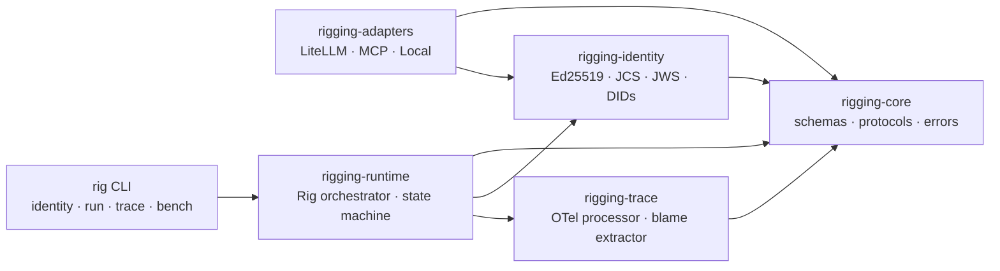

<div align="center">


<h1>rigging</h1>

<p><strong><em>A harness is for one agent. Rigging is for the fleet.</em></strong></p>

<p>The typed, trust-bearing, schema-mediated coupling layer that composes<br/>
heterogeneous harnessed agents into a single coherent system.</p>

<p>
  <a href="https://github.com/the-rigging-authors/rigging/actions/workflows/ci.yml"></a>
  <a href="https://github.com/the-rigging-authors/rigging/blob/main/LICENSE"></a>
  
  
  
  <a href="./CONCEPT.md"></a>
</p>

<p>
  <a href="https://the-rigging-authors.github.io/rigging/"><strong>Live site &amp; interactive demo →</strong></a>
  &nbsp;·&nbsp;
  <a href="./CONCEPT.md">Long-form essay</a>
  &nbsp;·&nbsp;
  <a href="./docs/spec/rig-contract-v0.md">Spec</a>
  &nbsp;·&nbsp;
  <a href="./benchmarks/results/v0-reference.md">Benchmarks</a>
  &nbsp;·&nbsp;
  <a href="./docs/FAQ.md">FAQ</a>
</p>

</div>

---

## Table of contents

- [The thirty-second pitch](#the-thirty-second-pitch)
- [60-second quickstart](#60-second-quickstart)
- [The three primitives](#the-three-primitives)
- [What it looks like in practice](#what-it-looks-like-in-practice)
- [Walk a real blame chain](#walk-a-real-blame-chain)
- [Rigging vs MCP, A2A, harnesses, supervisors](#rigging-vs-mcp-a2a-harnesses-supervisors)
- [The four runnable examples](#the-four-runnable-examples)
- [Architecture](#architecture)
- [Rigging-Bench v0](#rigging-bench-v0)
- [Repository layout](#repository-layout)
- [Roadmap](#roadmap)
- [FAQ](#faq)
- [Contributing](#contributing)
- [A note on the name](#a-note-on-the-name)
- [License](#license)

---

## The thirty-second pitch

> The interesting systems in 2026 do not have *an agent*. They have a planner, two coders that disagree, a reviewer that gates merges, a test-runner that is older and more boring than any of them, and a verifier whose entire job is to reject plans that try to do too much. Each is its own agent. Each has its own harness. **And they have to behave like a single system.**

That layer — the typed, signed, opinionated runtime that turns ad-hoc multi-agent glue into an auditable substrate — is *rigging*. This repository is its first reference implementation.

You can have a great harness on every agent and **still have terrible rigging**.

If you are not the model, and you are not the harness, you are the rigging.

---

## 60-second quickstart

```bash
git clone https://github.com/the-rigging-authors/rigging
cd rigging

# Install the workspace (Python 3.12+)
python -m pip install -e .

# Generate an Ed25519 identity (writes rig.key + rig.key.did)
RIG_PASS=hunter2 rig identity create --passphrase-env RIG_PASS

# Run the smallest example — planner delegates to worker, verifier audits
rig run 01-two-agent-handoff

# Inspect the resulting trace + blame chain in your terminal
rig trace inspect ./trace.json
```

No API keys. No network. Every example runs offline.

> 💡 **Prefer to look first?** The [**live site**](https://the-rigging-authors.github.io/rigging/) has an interactive blame-chain explorer — pick a failure mode and watch the runtime walk the DAG.

---

## The three primitives

A rig refuses to live without exactly three things:

<p align="center">
  
</p>

| | What it is | What it refuses |
|---|---|---|
| **① Signed agent cards** | An Ed25519-signed JSON document declaring an agent's capabilities, input/output schemas, and cost model. | Routing against an unsigned, malformed, or schema-mismatched card. |
| **② Delegation contracts** | A typed, signed bill of lading exchanged between two agents before any work crosses their boundary. Pins capability, budget, verifier, expiry. | Issuing contracts whose capabilities are undeclared, whose budgets are unbounded, or whose verifier is unreachable. |
| **③ Blame chains** | An ordered DAG of signed envelopes recovered from any trace. Walk it backwards to find the proximate cause of any failure. | Adjudicating fault — but making the question *mechanically answerable*. |

Cards. Contracts. Blame. **Everything else in a rig exists to keep those three primitives honest.**

---

## What it looks like in practice

Today, every production multi-agent stack ships a function that looks roughly like this:

```python
# the function every team writes, differently, incorrectly
trace_id = uuid()
contract = {"caller": "planner", "callee": callee}
try:
    out = await callee.run(req)
except Exception:
    out = await fallback.run(req)        # silently swap identity
cost[caller] += out.cost                 # ¯\_(ツ)_/¯
return out
```

With Rigging:

```python
from rigging.runtime import Rig
from rigging.adapters import LocalPythonAdapter
from rigging.identity import KeyPair

rig = Rig(name="my-system")
rig.register(planner, keypair=planner_key)
rig.register(worker,  keypair=worker_key)
rig.register(quality, keypair=quality_key)

result = await rig.call(
    caller=planner,
    callee_did=worker.did,
    capability="translate_pdf",
    input={"uri": "s3://docs/contract.pdf", "target_language": "fr"},
    cost_budget=("usd", "0.50"),
    verifier=quality.did,
)
```

What you get behind that one call:

- A signed contract from planner to worker.
- A schema check that the input matches the worker's declared `translate_pdf` shape.
- A per-contract budget the worker cannot exceed (and that does not leak into other contracts).
- A verifier sub-contract that audits the worker's output and signs its verdict.
- An OpenTelemetry-compatible trace with `rig.*` attributes.
- A **typed exception** — `VerifierRejected`, `BudgetOverrun`, `CalleeUnreachable`, `SignatureInvalid`, `ContractExpired`, … — if anything goes wrong, with a blame chain that names the responsible agent.

**No silent retries. No transparent fallback. No tribal knowledge.**

---

## Walk a real blame chain

When a multi-agent run fails, the trace contains an ordered chain of signed envelopes. Walk it backwards. The first envelope whose contents, if replaced by ground truth, would have prevented the failure — that envelope's signing key is the proximate cause.

<p align="center">
  
</p>

```
$ rig trace inspect ./trace.json --highlight=blame

trace 01HXQK3Z…                                14 signed envelopes
└── contract 01HXQK3Z (planner → worker · translate_pdf · budget=usd 0.50)
    ├── propose                                                    sig ✓
    ├── accept                                                     sig ✓
    ├── execute  ← proximate cause                                 sig ✓
    │   output: {pages:0, language:"??"}    schema_violation
    ├── verify (sub-contract)
    │   verdict: reject · reason: schema_violation                 sig ✓
    └── void   reason: verifier_rejected

blame ▶ did:rig:9rT…qN2    (worker)
```

> 🌊 [**Try it interactively on the live site →**](https://the-rigging-authors.github.io/rigging/#explorer)
> Pick a failure mode (adversarial output, budget overrun, expired contract, forged signature) and watch the runtime produce the chain step by step.

---

## Rigging vs MCP, A2A, harnesses, supervisors

A rig is not a wire format. It *uses* wire formats. A rig is not a harness. It *composes* harnesses. A rig is not a supervisor. It sits one floor up.

|                                       | MCP | A2A | Harness | Supervisor<br/><sub>(LangGraph, CrewAI)</sub> | **Rigging** |
|---------------------------------------|:---:|:---:|:-------:|:---------------------------------------------:|:-----------:|
| Tool wire format                      | ✓   | —   | —       | —                                             | ↗ *reuses*  |
| Agent-to-agent wire                   | —   | ✓   | —       | —                                             | ↗ *reuses*  |
| Single agent loop                     | —   | —   | ✓       | partial                                       | —           |
| Multi-agent routing                   | —   | —   | —       | ✓                                             | ✓ *typed*   |
| Signed capability advertisement       | —   | partial | —    | —                                             | **✓**       |
| Typed delegation contract             | —   | —   | —       | —                                             | **✓**       |
| Per-contract budget enforcement       | —   | —   | per agent | —                                           | **✓ recursive** |
| Verifier as first-class participant   | —   | —   | —       | convention                                    | **✓**       |
| Cross-agent blame extraction          | —   | —   | —       | —                                             | **✓**       |
| Refuses silent retries                | n/a | n/a | policy  | policy                                        | **✓ structural** |

A longer survey is at [`docs/related-work.md`](./docs/related-work.md), with an entry per project (A2A, MCP, ACP, OASF, KYA, OpenHarness, LangGraph, CrewAI, AutoGen, `loom-agent`, Teradata `loom`).

---

## The four runnable examples

Each runs offline. No API keys, no network. Each has its own `README.md`.

| | Example | What it demonstrates |
|---|---|---|
| <kbd>**01**</kbd> | [`01_two_agent_handoff`](./examples/01_two_agent_handoff/) | The minimum viable rig — planner delegates to worker, verifier audits. |
| <kbd>**02**</kbd> | [`02_three_vendor_rig`](./examples/02_three_vendor_rig/) | Heterogeneous composition — three vendors, one rig. |
| <kbd>**03**</kbd> | [`03_adversarial_subagent`](./examples/03_adversarial_subagent/) | Compositional reliability — verifier catches the bad worker; blame chain names it. |
| <kbd>**04**</kbd> | [`04_cost_attribution`](./examples/04_cost_attribution/) | A → B → C with explicit sub-budgets; C overruns; A's budget is inviolable. |
| <kbd>**05**</kbd> | [`05_vote_ensemble`](./examples/05_vote_ensemble/) | Three verifiers; majority rules. Disagreement is a composition problem, not a runtime problem. |

```bash
rig run 01-two-agent-handoff       # short
rig run 02-three-vendor-rig
rig run 03-adversarial-subagent
rig run 04-cost-attribution
rig run 05-vote-ensemble
```

A walkthrough of all five with annotated traces is at [`docs/EXAMPLES.md`](./docs/EXAMPLES.md).

---

## Architecture

Five small packages, one CLI, one-direction dependency graph. Provider-agnostic core. All LLM/MCP code lives only in adapters.

<p align="center">
  
</p>



The full architecture, sequence diagram, state machine, and trust-boundary discussion is at [`docs/architecture.md`](./docs/architecture.md).

---

## Rigging-Bench v0

A five-axis benchmark the project is scored against — *honestly*. We do not claim 100% across the board, and we name the gaps.

| Axis | Score | Notes |
|---|---:|---|
| Capability-advertisement fidelity | **0.50** | Floor is structural — half the probes go to a dishonest agent. |
| Delegation-contract expressiveness | **1.00** | Handoff, voting ensemble, recursive subcontracting, conditional delegation: all expressible. |
| Identity propagation | **0.85** | Spoofing, tampering, wrong-key covered. Revocation is v1. |
| Cost-attribution accuracy | **1.00** | Zero L1 error on the synthetic chain. |
| Blame-resolution correctness | **0.70** | Leaf attribution solid. Planner-misroutes and verifier-itself-wrong are v1. |
| **Overall** | **0.81** | *We do not claim higher than the suite honestly supports.* |

```bash
rig bench           # smoke (under a minute)
rig bench --full    # comprehensive
```

Full report: [`benchmarks/results/v0-reference.md`](./benchmarks/results/v0-reference.md).
Methodology: [`docs/benchmarks/rigging-completeness-matrix.md`](./docs/benchmarks/rigging-completeness-matrix.md).

---

## Repository layout

```
rigging/
├── CONCEPT.md                # The seminal essay (~2k words)
├── README.md                 # You are here
├── site/                     # GitHub Pages source (live demo)
├── assets/                   # SVG hero, diagrams, brand
├── docs/
│   ├── architecture.md       # Package graph + per-call sequence + state machine
│   ├── related-work.md       # MCP · A2A · ACP · OASF · LangGraph · CrewAI · …
│   ├── EXAMPLES.md           # Annotated walkthrough of the five examples
│   ├── FAQ.md                # The questions we get every week
│   ├── roadmap.md            # What's in v0, what's in v1
│   ├── spec/                 # v0 specs: identity, agent-card, contract, trace
│   ├── adr/                  # 10 architecture decision records
│   └── benchmarks/           # Methodology of the Rigging Completeness Matrix
├── packages/
│   ├── rigging-core/         # Schemas · protocols · errors
│   ├── rigging-identity/     # Ed25519 · JCS · JWS · signed cards
│   ├── rigging-trace/        # OTel processor · blame-chain extractor
│   ├── rigging-adapters/     # Local · LiteLLM · MCP
│   └── rigging-runtime/      # The Rig orchestrator + CLI
├── examples/                 # 01..05 runnable examples (offline, no API keys)
├── benchmarks/rig_bench/     # Rigging-Bench v0
└── tests/                    # 76 tests · unit · integration · property (hypothesis)
```

The dependency graph between packages is one-direction. Adapters never import from runtime.

---

## Roadmap

**v0 (this release):** the five primitives, the four specs, ten ADRs, five examples, the five-axis benchmark, the CLI, the live site.

**v1 (the immediate horizon):**

- Mid-chain blame attribution (planner-misroutes, verifier-itself-wrong, recursive verification).
- Card revocation (without forcing key rotation).
- KMS-backed signing.
- A real `rigging-viz` web visualizer.
- One real-world harness adapter (LangGraph or Goose or AutoGen — picking based on community pull).
- TLA+ model of the contract-negotiation protocol; liveness and safety checked.

Full roadmap: [`docs/roadmap.md`](./docs/roadmap.md). Issues tagged `v1` are open.

---

## FAQ

The short version is below; the full FAQ lives at [`docs/FAQ.md`](./docs/FAQ.md).

<details>
<summary><strong>Is this a new wire protocol?</strong></summary>
<br/>
No. Rigging sits <em>above</em> MCP and A2A. Tool calls inside a harness flow over MCP; the contract flows over A2A (or any equivalent); the trace flows over OpenTelemetry. A rig that invents a new wire format is, by our definition, doing it wrong.
</details>

<details>
<summary><strong>Is the verifier privileged?</strong></summary>
<br/>
No — and we tried that first. A verifier is just an agent whose card declares a <code>verify</code> capability. The runtime invariants apply to it uniformly. Disagreement becomes a composition problem (vote, recurse), not a runtime problem. See <a href="./docs/adr/0007-verifier-as-agent.md">ADR-0007</a>.
</details>

<details>
<summary><strong>Why refuse silent retries?</strong></summary>
<br/>
A retry against a fresh agent produces output signed by an identity the caller did not address. The trace shows A → B but the work was done by B′. Blame analysis terminates in a contradiction. Retries are first-class events, with their own contracts and their own identifiers.
</details>

<details>
<summary><strong>Why Ed25519 and not OIDC/OAuth?</strong></summary>
<br/>
v0 only needs to answer "is this card real and unchanged?" Long-lived per-agent Ed25519 keys solve that with no infrastructure. OAuth/OIDC is a v1 conversation.
</details>

<details>
<summary><strong>Does the rig know about LLMs?</strong></summary>
<br/>
No. <code>rigging-core</code> and <code>rigging-runtime</code> contain zero LLM-specific code. All provider concerns live under <code>rigging-adapters</code>.
</details>

<details>
<summary><strong>How do you stop one caller from putting charges on another caller's card?</strong></summary>
<br/>
Cost is a property of a contract, not of an agent. B may subcontract to C only by carving a sub-budget from its own allocation. C's overruns hit B's ledger; A's budget is inviolable. See <a href="./docs/adr/0006-explicit-budget-propagation.md">ADR-0006</a>.
</details>

<details>
<summary><strong>Will you ship a web dashboard?</strong></summary>
<br/>
Not in v0. The TUI is sufficient, and the <a href="https://the-rigging-authors.github.io/rigging/">live site</a> is the visual demo. A dedicated <code>rigging-viz</code> is on the v1 roadmap.
</details>

---

## Contributing

We welcome PRs. Especially welcome: adversarial scenarios for the benchmark, real-world harness adapters, and corrections to the spec.

- **First time?** Read [`CONTRIBUTING.md`](./CONTRIBUTING.md). It is short.
- **Code of conduct:** [`CODE_OF_CONDUCT.md`](./CODE_OF_CONDUCT.md) (Contributor Covenant v2.1).
- **Reporting vulnerabilities:** [`SECURITY.md`](./SECURITY.md). Do not file public issues for security reports.
- **Disagree with a design call?** Write an ADR-style counter-proposal and PR it under [`docs/adr/`](./docs/adr/). We will engage.

```bash
# Hack on the runtime
python -m pip install -e ".[dev]"
pytest tests/ -q                # 76 tests, ~3 seconds
ruff check . && mypy packages/  # lint + types
```

---

## A note on the name

The English word *rigged* has fraudulent connotations. We do not. Throughout this project, *rigging* refers to its **maritime sense**: the load-bearing web of ropes, blocks, and lines on a sailing ship. The sails do not move the ship. The hull does not move the ship. The rigging does.

> *A rig refuses to route against unsigned cards. A rig refuses to issue contracts whose capabilities are undeclared. A rig refuses to retry silently. A rig refuses to attribute cost to anyone other than the contract holder. A rig refuses to admit unverified output as verified.*
>
> *The art of this layer is in what it refuses, not in what it provides.*

---

<div align="center">

<sub>Apache 2.0 · © The Rigging Authors · Built for skeptical practitioners and ICLR/NeurIPS reviewers alike.</sub>

<br/>

<sub><strong><a href="https://the-rigging-authors.github.io/rigging/">Live site →</a></strong> · <a href="./CONCEPT.md">CONCEPT.md</a> · <a href="./docs/spec/rig-contract-v0.md">Spec</a> · <a href="./benchmarks/results/v0-reference.md">Benchmarks</a> · <a href="https://github.com/the-rigging-authors/rigging/issues">Issues</a></sub>

</div>
