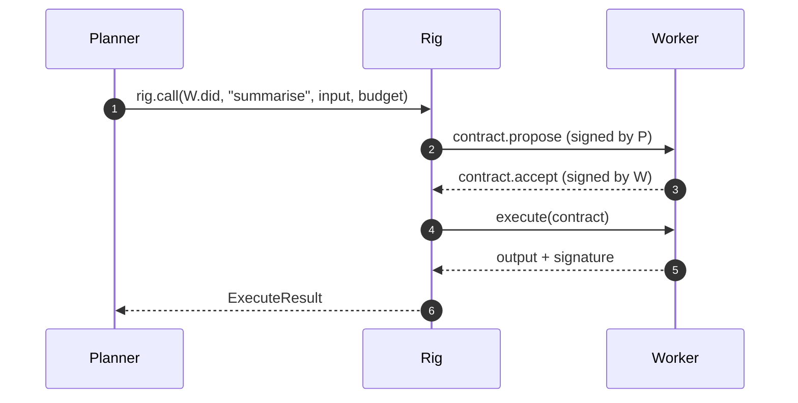
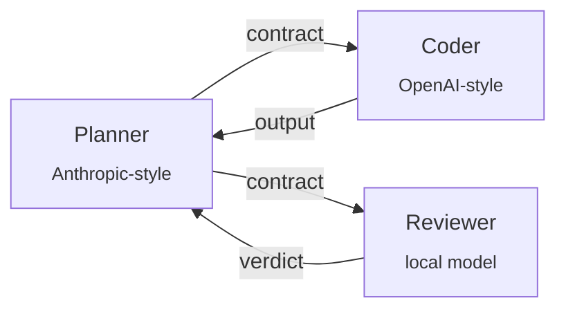
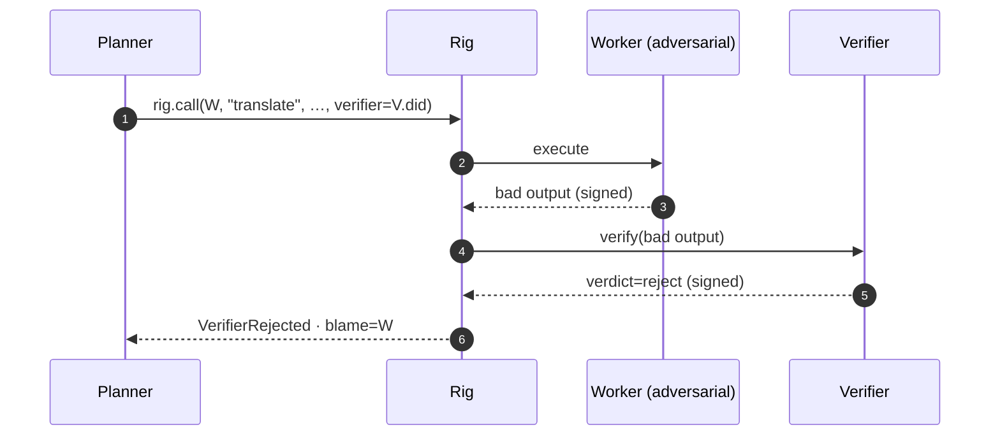
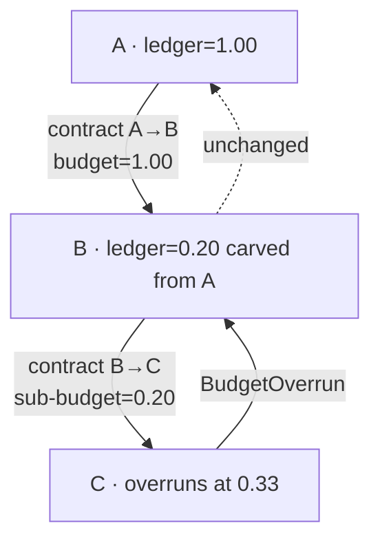
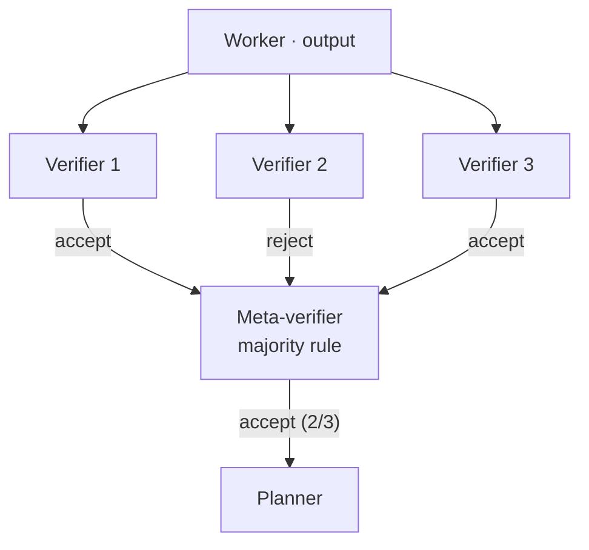

# Examples — annotated walkthrough

> Each example is a self-contained Python script under
> [`examples/`](../examples). They run **offline**, with no API keys,
> using the `LocalPythonAdapter`. Each one isolates one rig invariant so
> you can read it in five minutes and steal the pattern.

```bash
# any of these
rig run 01-two-agent-handoff
rig run 02-three-vendor-rig
rig run 03-adversarial-subagent
rig run 04-cost-attribution
rig run 05-vote-ensemble

# or the long form
python -m examples.01_two_agent_handoff.run
```

---

## 01 · Two-agent handoff — *"hello, rig"*

**Path:** [`examples/01_two_agent_handoff/`](../examples/01_two_agent_handoff/)

The minimum viable rig. A planner agent delegates one step to a worker
agent. No verifier. No subcontracts. Two keypairs, two signed cards, one
contract.



**Spans you will see in the trace**

```
rig.contract.propose      caller=planner    callee=worker    sig ✓
rig.contract.accept       caller=planner    callee=worker    sig ✓
rig.execute               output_hash=sha256:…               sig ✓
rig.cost.debit            unit=usd  cost=0.05  remaining=0.45
```

**The invariant exercised:** the worker's output envelope is signed by
the worker's key. Tamper with one byte and the next example
(`03_adversarial_subagent`) becomes a structural failure.

---

## 02 · Three-vendor rig — heterogeneous composition

**Path:** [`examples/02_three_vendor_rig/`](../examples/02_three_vendor_rig/)

Three agents from three different "vendors": a planner, a coder, and a
reviewer. Each has its own harness; each runs its own loop; each speaks
to the rig through the same `Agent` protocol.



The example uses `LocalPythonAdapter` for all three so the script runs
offline, but the structure is identical for a real heterogeneous setup
(`LiteLLMAdapter` for the LLM agents, `MCPAdapter` for the tool-bearing
ones).

**The invariant exercised:** the rig's surface is identical across
vendors. **The participant's harness has no visibility into the rig**,
and the rig has no visibility into the harness internals.

---

## 03 · Adversarial sub-agent — compositional reliability under failure

**Path:** [`examples/03_adversarial_subagent/`](../examples/03_adversarial_subagent/)

A planner delegates to a worker. The worker is *deliberately* configured
to return adversarial output — either a schema violation or a prompt
injection masquerading as data. A verifier sub-contract audits the
output and rejects it.



The operator sees `VerifierRejected`. The trace's blame chain points at
the worker's DID unambiguously: the verifier's verdict references the
worker's signed output envelope as the proximate cause.

**The invariant exercised:** the rig **does not** silently retry, swap
to a different worker, or absorb the failure. The brittleness is the
feature. See [ADR-0009](./adr/0009-no-silent-retries.md).

---

## 04 · Cost attribution — sub-budgets compose

**Path:** [`examples/04_cost_attribution/`](../examples/04_cost_attribution/)

Three nested agents:

```
A  ── budget = usd 1.00 ──▶  B  ── sub-budget = usd 0.20 ──▶  C
```

C overruns its 0.20 budget (e.g. uses 0.33). The example demonstrates
that:

1. The runtime detects the overrun and raises `BudgetOverrun`.
2. The cost is attributed to **B's** ledger, not A's.
3. A's remaining budget is unchanged.



**The invariant exercised:** cost is a property of a *contract*, not of
an *agent*. Sub-budgets compose. The original caller is not on the hook
for downstream subcontractors. See
[ADR-0006](./adr/0006-explicit-budget-propagation.md).

---

## 05 · Vote-ensemble verifier — disagreement is composition

**Path:** [`examples/05_vote_ensemble/`](../examples/05_vote_ensemble/)

A worker produces an output. Three independent verifiers each vote
`accept` or `reject` in their own signed verdict. A *meta-verifier* (also
a rig participant) tallies the votes and produces the final verdict.



The trace contains *four* signed verdict envelopes: three from the
component verifiers and one from the meta-verifier. The blame chain, on
failure, points at the verifier(s) whose verdict the meta-verifier
adopted.

**The invariant exercised:** because the verifier is a first-class rig
participant (not a privileged role), ensemble verification is just
composition. The runtime has zero special-case code for it. See
[ADR-0007](./adr/0007-verifier-as-agent.md).

---

## Reading the traces

All examples write `./trace.json`. The CLI renders them:

```bash
rig trace inspect ./trace.json
```

The output uses Rich; `--highlight=blame` boxes the proximate envelope
on failure.

If you want to feed traces into a custom dashboard, the schema is
documented in [`docs/spec/trace-v0.md`](./spec/trace-v0.md).

---

## What to build next

Once you have read all five, the most natural next step is to write
your own adapter. The reference adapters
([`packages/rigging-adapters/`](../packages/rigging-adapters/)) are
all under 200 LOC; the `Agent` protocol in
[`rigging-core`](../packages/rigging-core/src/rigging/core/protocols.py)
is the entire surface you need to implement.

We welcome adapter PRs. Particularly interested in:

- LangGraph supervisor → rig participant.
- AutoGen group chat → rig participant.
- Goose recipe → rig participant.
- One-off REST agents that someone else operates.
