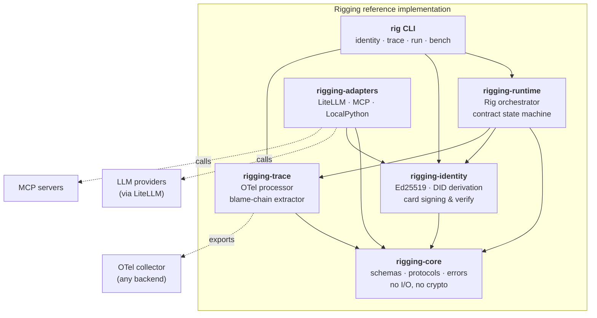
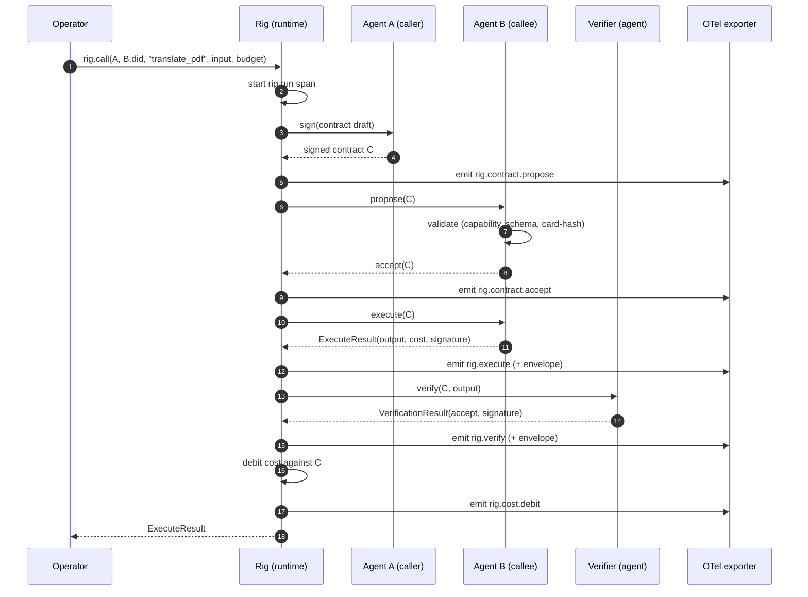
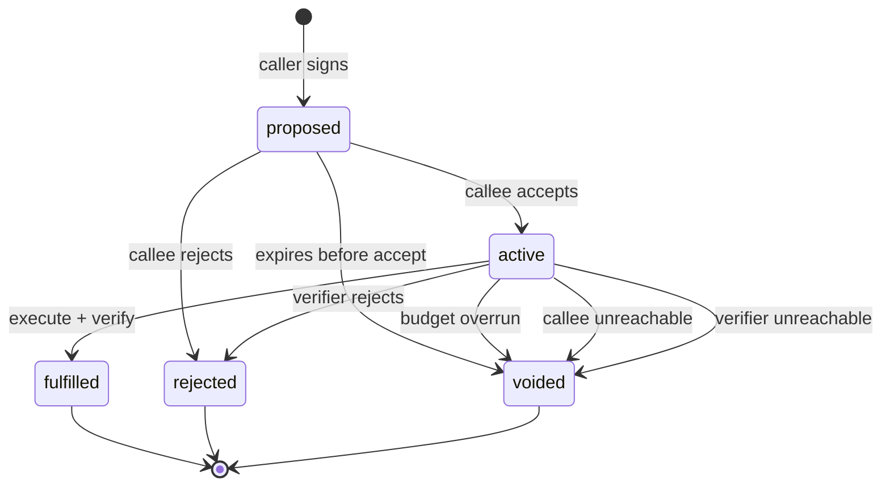

# Architecture

> How the rigging packages fit together. Read [`CONCEPT.md`](../CONCEPT.md)
> first for the *why*; this document is the *how*.

---

## 1. Package layout

The reference implementation is five small packages plus a CLI.

The dependency arrows go one direction only. `rigging-core` knows about
nothing outside itself; `rigging-runtime` knows about core, identity,
and trace but does not know about any adapter. This keeps the rig
provider-agnostic: every LLM-specific or harness-specific concern lives
under `rigging-adapters`.

## 2. A single delegation, step by step

Concretely: agent A calls capability `translate_pdf` on agent B.

Every dashed bidirectional or signed envelope in the diagram is a
checkpoint the runtime can refuse at. If any step fails, the contract is
moved to `rejected` or `voided` with a reason code, the typed error
propagates to the operator, and the trace is preserved.

## 3. The contract state machine

Terminal states (`fulfilled`, `rejected`, `voided`) are immutable. There
is no edge labelled "silently retry". By design.

## 4. Module-by-module responsibilities

### `rigging-core`

The bedrock. Pydantic models for `AgentCard`, `Contract`, `SpanRecord`,
`TraceRecord`, `BlameChain`. Protocols for `Agent`, `Verifier`, `Rig`.
The `RigError` hierarchy. The `DID` type and `derive_did` /
`parse_did` helpers.

Notably absent: any cryptography (`identity` has that), any I/O, any
LLM-specific code, any logging that isn't structured-error-level.

### `rigging-identity`

The crypto package. Ed25519 keypair generation, encrypted PEM storage,
JCS canonicalisation, JWS signing and verification, the
`derive_did` function (re-exported from core for convenience), and
the `rig identity` CLI subcommands.

This is the *only* package that imports `cryptography`. If you find
yourself importing `cryptography` somewhere else, you have probably
missed a layering boundary.

### `rigging-trace`

The OpenTelemetry adapter layer. Defines a custom span processor that
recognises `rig.*` attributes, converts spans into `SpanRecord`
instances, and implements the blame-chain extractor described in
`docs/spec/trace-v0.md` §3.

Also home of the `rig trace inspect` CLI subcommand, which uses Rich
to render traces and blame chains for humans.

### `rigging-adapters`

The bridges. Each adapter wraps an existing harness or runtime as a
rig participant:

- `LocalPythonAdapter` — for tests and the simplest examples. Wraps an
  `async def` that conforms to the capability's input/output schema.
- `LiteLLMAdapter` — wraps any LiteLLM-compatible model.
- `MCPAdapter` — wraps an MCP server; tools become rig capabilities via
  an explicit translation per ADR-0008.

Total LOC budget across all three: under 500. Adapters are not where
the cleverness goes; the cleverness goes in `rigging-runtime`.

### `rigging-runtime`

The orchestrator. Implements `Rig`: the registry of agent cards, the
contract negotiation state machine, sub-contract issuance, budget
arithmetic, verifier invocation, and trace emission. The interesting
files are:

- `rig.py` — the `Rig` class itself, the `register` and `call` methods.
- `negotiation.py` — propose/accept/reject sequence, signature checks.
- `budget.py` — per-contract ledgers, parent-budget invariants, overrun
  detection.
- `state.py` — the state machine encoded in §3 above.

### `rig` CLI

A single Typer-based entry point. Subcommands:

- `rig identity create | show | verify`
- `rig run <example-name>`
- `rig trace inspect <trace-id>`
- `rig bench run [--full]`
- `rig spec validate <document>`

The CLI is small. Most of the surface is delegated to the underlying
packages; the CLI is mostly argument parsing and pretty printing.

## 5. The trust boundaries

Three kinds of trust boundary appear in a rig run, and the
implementation makes each one a place where a signature is checked.

1. **Operator → caller.** The operator's policy (out-of-band) declares
   which agents may be invoked as the root caller. The rig does not
   model this; it accepts the operator's say-so.
2. **Caller → callee.** The caller's signature on the contract pins
   *who is asking*. The callee verifies before accepting.
3. **Callee → verifier.** The callee's signature on the output pins
   *who produced this*. The verifier verifies the callee's signature
   before opining; the verifier's own signature pins *who decided*.

These are the only three. Anything that looks like it should be a
fourth is, on inspection, one of these three again.

## 6. Versioning

Every on-disk format (`AgentCard`, `Contract`, span schema) carries an
explicit `*_version` string of the form
`rigging/<kind>/v0`. v1 is allowed to break these formats; the
runtime refuses to load a document with an unrecognised version.

No backwards-compatibility shims will be added for v0→v1. The whole
point of v0 is to make the v0→v1 transition cheap by making it
explicit.

## 7. Testing strategy

- `tests/unit/` — per-module unit tests against the public surface.
- `tests/integration/` — multi-package scenarios; run the rig end-to-end
  with `LocalPythonAdapter` agents.
- `tests/property/` — Hypothesis property tests for the
  invariants that cannot be exhausted by examples: blame-chain
  extraction is correct for any DAG; budget arithmetic does not lose
  pennies; canonical JSON round-trips.

The benchmark suite (`benchmarks/rig_bench/`) is *not* a test suite —
it is the **Rigging Completeness Matrix** described in §7 of the
master prompt, scored against any rig implementation.
